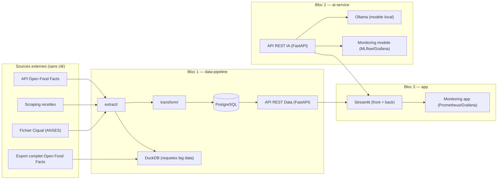

# Architecture technique — NutriScan IA

## 1. Vue d'ensemble

Le projet est découpé en **3 composants faiblement couplés**, chacun correspondant à un bloc de compétences et exposé via une API REST documentée. Chaque composant a sa propre couche présentation/métier/données (n-tiers), sans aller jusqu'à une architecture micro-services complète (inutile pour un projet solo). **Aucun composant ne nécessite de compte ni de clé API externe.**

## 2. Justification du choix d'architecture

- **Séparation par bloc de compétences** plutôt que par couche technique classique : chaque composant (`data-pipeline`, `ai-service`, `app`) est démontrable et évaluable indépendamment, ce qui correspond directement au découpage des épreuves E1/E2+E3/E4+E5.
- **Communication par API REST uniquement** entre composants : aucun composant n'accède directement à la base d'un autre, ce qui limite le couplage et facilite les tests et le remplacement futur du service IA.
- **Zéro dépendance à un compte/clé externe** : Open Food Facts (API et export) est en accès libre, Ciqual est un fichier public téléchargeable, le scraping ne nécessite pas d'authentification, et Ollama exécute le modèle d'IA en local. Ce choix élimine tout risque de blocage administratif (délai d'obtention de clé, quota, changement de conditions d'un fournisseur tiers) et renforce l'argument de confidentialité puisque les données de santé (allergies) ne quittent jamais l'environnement applicatif.
- **Pas de micro-services fins** (pas un service par fonctionnalité) : la charge d'orchestration ne se justifie pas pour un projet solo sur 13 semaines ; un service par bloc suffit à démontrer la compétence tout en restant maintenable.

## 3. Stack technique par composant

| Composant | Langages / frameworks | Stockage | Tests | CI/CD |
|---|---|---|---|---|
| `data-pipeline` | Python, requests, BeautifulSoup, pandas, DuckDB, FastAPI | PostgreSQL (données applicatives) + fichier Parquet/CSV interrogé par DuckDB (export OFF) | pytest, Great Expectations | GitHub Actions |
| `ai-service` | Python, FastAPI, Ollama (SDK/API locale), MLflow | Fichiers de métriques / MLflow tracking | pytest (extraction, matching) | GitHub Actions (MLOps) |
| `app` | Python, Streamlit | Consomme les API des deux autres blocs (pas de base propre) | pytest | GitHub Actions |
| Transverse | Docker / Docker Compose (dev), Git/GitHub | — | — | — |

## 4. Sécurité

- Authentification par JWT entre le frontend et les API (`api_data`, `api_ia`), jetons à expiration courte.
- Chiffrement au repos (`pgcrypto` ou équivalent) pour la table `UTILISATEUR_ALLERGENE`, qui contient une donnée de santé.
- Secrets (identifiants base de données, éventuelle clé de chiffrement) exclusivement via variables d'environnement (`.env`, jamais commité — voir `.gitignore`), avec `.env.example` documentant les clés attendues.
- Application des recommandations OWASP Top 10 API et Top 10 Web pertinentes (validation des entrées, limitation de débit, pas d'information technique dans les messages d'erreur exposés).
- HTTPS obligatoire dès la mise en pré-production.

## 5. Accessibilité

Objectif **WCAG 2.1 AA / RGAA** sur l'ensemble des interfaces, avec une exigence renforcée sur les alertes allergènes qui ont un enjeu de sécurité (voir critères détaillés dans `user-stories.md`, US4).

## 6. Éco-conception et éco-responsabilité

- Exécution locale du modèle d'IA (Ollama) : pas d'appel réseau à un service cloud pour chaque analyse, empreinte réduite par rapport à une API payante à l'appel.
- Mise en cache des réponses Open Food Facts et des analyses de compatibilité déjà calculées pour un même couple profil/produit.
- Interrogation ponctuelle (et non une réplication permanente) de l'export complet Open Food Facts via DuckDB, pour limiter le stockage.
- Hébergement mutualisé en free tier plutôt qu'infrastructure dédiée pour la pré-production.

## 7. Déploiement

- **Développement** : Docker Compose local (PostgreSQL + les 3 services + Ollama), reproductible par `docker compose up`.
- **Pré-production — décision prise en S10** : une mise en ligne réelle chez un hébergeur tiers (Render/Railway/Hugging Face Spaces...) exigerait de créer un compte externe, ce qui contredit le principe zéro-compte posé ci-dessus. Choix retenu : la CD ([`docs/04-bloc3-app/cd.md`](../04-bloc3-app/cd.md)) publie des images Docker versionnées sur **GitHub Container Registry** (jetons `GITHUB_TOKEN` intégrés, zéro nouveau compte) pour les trois composants ayant une CI/CD (`api_ia` depuis S8 ; `app_backend` et `app_frontend` depuis S10). Le déploiement effectif chez un hébergeur reste une étape ultérieure explicitement documentée comme telle, plutôt que silencieusement escamotée.

## 8. Points ouverts (à trancher plus tard, sans bloquer le cadrage)

- Modèle Ollama définitif (taille/quantification) : après benchmark S4 (`docs/03-bloc2-ia/benchmark-services-ia.md`).
- Outil de monitoring applicatif définitif (Prometheus+Grafana vs solution hébergée gratuite) : après S11.
