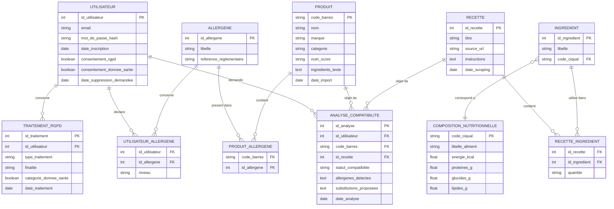

# Modélisation des données (Merise) — NutriScan IA

## 1. Dictionnaire des données (extrait)

| Entité | Rôle |
|---|---|
| UTILISATEUR | Compte, consentements RGPD (dont consentement spécifique donnée de santé) |
| ALLERGENE | Référentiel officiel des 14 allergènes à déclaration obligatoire (règlement INCO) |
| UTILISATEUR_ALLERGENE | Profil allergène/intolérance/préférence de l'utilisateur — **donnée de santé** |
| PRODUIT | Produit alimentaire importé depuis Open Food Facts |
| INGREDIENT | Ingrédient normalisé, éventuellement rattaché à une entrée Ciqual |
| COMPOSITION_NUTRITIONNELLE | Valeurs nutritionnelles officielles (table Ciqual, ANSES) |
| RECETTE | Recette collectée par scraping |
| ANALYSE_COMPATIBILITE | Résultat d'une analyse de compatibilité IA pour un utilisateur + un produit ou une recette |
| TRAITEMENT_RGPD | Journal des traitements de données personnelles (registre RGPD) |

## 2. Modèle conceptuel de données (MCD)



## 3. Règles de gestion (cardinalités)

- Un utilisateur peut déclarer plusieurs allergènes/régimes, un allergène peut concerner plusieurs utilisateurs → association `UTILISATEUR_ALLERGENE` (n,n) porteuse du niveau (allergie/intolérance/préférence). **Cette table contient de la donnée de santé et doit être chiffrée au repos / soumise à des droits d'accès stricts.**
- Un produit peut contenir plusieurs allergènes, un allergène peut être présent dans plusieurs produits → association `PRODUIT_ALLERGENE` (n,n).
- Une recette comporte plusieurs ingrédients, un ingrédient peut apparaître dans plusieurs recettes → association `RECETTE_INGREDIENT` (n,n) porteuse d'une quantité.
- Un ingrédient est rattaché à au plus une entrée Ciqual (0,1) permettant de récupérer sa composition nutritionnelle officielle.
- Une analyse porte sur un utilisateur et, exclusivement, un produit **ou** une recette (jamais les deux à la fois) : c'est l'historique consommé par US7.
- Chaque action de traitement de donnée personnelle (création de profil allergène, suppression de compte) est journalisée dans `TRAITEMENT_RGPD`, avec un indicateur explicite `categorie_donnee_sante` pour faciliter l'audit du registre (voir `docs/rgpd/registre-traitements.md`, rédigé en S3).

## 4. Passage au modèle logique de données (MLD)

Règles Merise appliquées :
- Une entité devient une table, chaque propriété une colonne.
- Une relation (1,n) devient une clé étrangère côté table « n ».
- Une relation (n,n) porteuse de données devient une table d'association avec les deux clés étrangères en clé primaire composite, plus ses propres attributs.

Aperçu (le schéma SQL définitif sera versionné en S3 dans `data-pipeline/db/schema.sql`) :

```sql
UTILISATEUR(id_utilisateur PK, email, mot_de_passe_hash, date_inscription, consentement_rgpd, consentement_donnee_sante, date_suppression_demandee)
ALLERGENE(id_allergene PK, libelle, reference_reglementaire)
UTILISATEUR_ALLERGENE(id_utilisateur FK -> UTILISATEUR, id_allergene FK -> ALLERGENE, niveau, PRIMARY KEY(id_utilisateur, id_allergene))
PRODUIT(code_barres PK, nom, marque, categorie, nutri_score, ingredients_texte, date_import)
PRODUIT_ALLERGENE(code_barres FK -> PRODUIT, id_allergene FK -> ALLERGENE, PRIMARY KEY(code_barres, id_allergene))
COMPOSITION_NUTRITIONNELLE(code_ciqual PK, libelle_aliment, energie_kcal, proteines_g, glucides_g, lipides_g)
INGREDIENT(id_ingredient PK, libelle, code_ciqual FK -> COMPOSITION_NUTRITIONNELLE NULL)
RECETTE(id_recette PK, titre, source_url, instructions, date_scraping)
RECETTE_INGREDIENT(id_recette FK -> RECETTE, id_ingredient FK -> INGREDIENT, quantite, PRIMARY KEY(id_recette, id_ingredient))
ANALYSE_COMPATIBILITE(id_analyse PK, id_utilisateur FK -> UTILISATEUR, code_barres FK -> PRODUIT NULL, id_recette FK -> RECETTE NULL, statut_compatibilite, allergenes_detectes, substitutions_proposees, date_analyse)
TRAITEMENT_RGPD(id_traitement PK, id_utilisateur FK -> UTILISATEUR, type_traitement, finalite, categorie_donnee_sante, date_traitement)
```

## 5. Choix du SGBD

**PostgreSQL** : gratuit, robuste, support natif du chiffrement par colonne (`pgcrypto`) pertinent pour la table `UTILISATEUR_ALLERGENE`, largement supporté par les hébergeurs free tier (Neon, Supabase, Render) envisagés pour la pré-production (voir `architecture.md`).

L'export complet Open Food Facts (plusieurs millions de lignes) n'est **pas** répliqué dans cette base applicative : il est interrogé ponctuellement via **DuckDB** en local pour les besoins analytiques du bloc 1 (compétence « système big data »), voir `docs/02-bloc1-data/extraction.md`.
