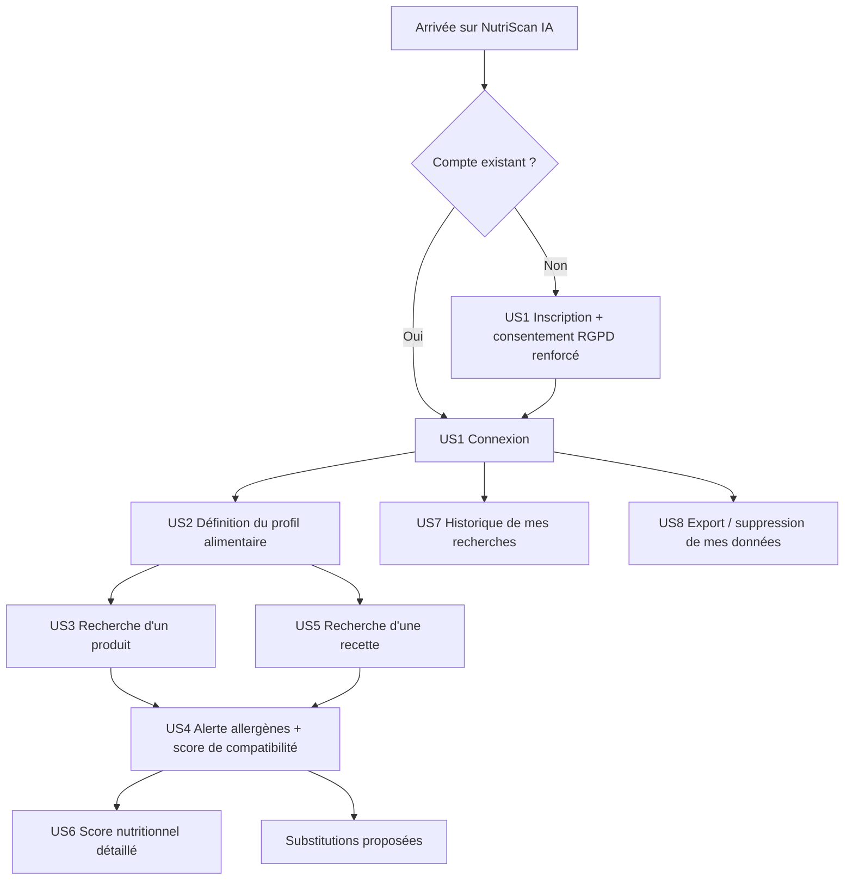

# User stories — NutriScan IA

Backlog initial (S1). Chaque story sera reprise dans [`backlog.md`](backlog.md) et affinée au fil des sprints. Les critères d'accessibilité s'appuient sur le référentiel **WCAG 2.1 niveau AA** (et son équivalent français **RGAA**).

## Parcours utilisateur (vue d'ensemble)

## US1 — Inscription et connexion sécurisées

**Contexte** : un utilisateur découvre NutriScan IA et souhaite l'utiliser avec son propre profil.
**Scénario** : en tant qu'utilisateur, je veux créer un compte protégé par mot de passe et donner un consentement explicite et distinct au traitement de mes données de santé (allergies), afin d'accéder à un espace personnel sécurisé.

Critères d'acceptation fonctionnels :
- L'inscription exige email, mot de passe (règles de robustesse) et **deux** cases de consentement distinctes et non pré-cochées : consentement RGPD général, et consentement spécifique au traitement de données de santé (allergies/intolérances).
- Le mot de passe est stocké haché (jamais en clair).
- Un avertissement produit (« NutriScan IA ne constitue pas un avis médical ») est affiché avant la première utilisation et reste accessible à tout moment.

Critères d'acceptation accessibilité :
- Chaque champ de formulaire a un `<label>` associé et un message d'erreur annoncé aux lecteurs d'écran (`aria-describedby`).
- Le parcours est intégralement utilisable au clavier (tabulation, validation par Entrée).

## US2 — Définir mon profil alimentaire

**Scénario** : en tant qu'utilisateur connecté, je veux renseigner mes allergies, intolérances et mon régime alimentaire, afin que l'application puisse évaluer la compatibilité des produits et recettes pour moi.

Critères d'acceptation fonctionnels :
- Les allergènes proposés s'appuient sur le référentiel officiel des 14 allergènes à déclaration obligatoire (règlement INCO 1169/2011).
- L'utilisateur peut distinguer « allergie », « intolérance » et « préférence » (ex. végétarien) pour un même ingrédient/régime.
- Le profil est modifiable à tout moment, et chaque modification est horodatée.

Critères d'acceptation accessibilité :
- La sélection multiple d'allergènes utilise des cases à cocher natives, étiquetées individuellement (pas de simple liste cliquable non sémantique).

## US3 — Rechercher un produit

**Scénario** : en tant qu'utilisateur, je veux rechercher un produit par nom ou code-barres, afin de consulter sa composition avant de l'acheter ou le consommer.

Critères d'acceptation fonctionnels :
- La recherche interroge les données Open Food Facts (via l'API `data-pipeline`) et affiche nom, marque, catégorie, liste d'ingrédients et Nutri-Score existant.
- En l'absence de résultat, un message explicite est affiché (pas d'écran vide silencieux).

Critères d'acceptation accessibilité :
- Les résultats sont structurés avec des titres hiérarchiques (`<h2>`/`<h3>`), pas uniquement une mise en forme visuelle.
- Contraste texte/fond conforme WCAG AA (ratio ≥ 4.5:1).

## US4 — Alerte allergènes et score de compatibilité

**Scénario** : en tant qu'utilisateur, je veux être alerté si un produit ou une recette contient un ingrédient incompatible avec mon profil, afin d'éviter une erreur de consommation.

Critères d'acceptation fonctionnels :
- L'analyse IA croise la liste d'ingrédients du produit/recette avec le profil de l'utilisateur et retourne un statut (compatible / à risque / incompatible) et la liste des ingrédients concernés.
- Le raisonnement est explicable en une phrase affichée à l'utilisateur (transparence de la décision algorithmique) — pas de « boîte noire ».
- Le calcul est reproductible : deux analyses du même couple profil/produit sans modification donnent le même résultat.

Critères d'acceptation accessibilité :
- Le statut de compatibilité n'est **jamais** communiqué uniquement par la couleur : texte explicite et icône avec alternative textuelle (`alt`) obligatoires, en particulier pour une alerte allergène qui a un enjeu de sécurité.

## US5 — Rechercher une recette et ses substitutions

**Scénario** : en tant qu'utilisateur, je veux rechercher une recette compatible avec mon profil et obtenir des substitutions d'ingrédients si besoin, afin de continuer à cuisiner varié malgré mes contraintes alimentaires.

Critères d'acceptation fonctionnels :
- La recherche porte sur le corpus de recettes collecté par scraping (`data-pipeline`).
- Pour chaque ingrédient incompatible détecté, au moins une substitution est suggérée (ex. lait → boisson végétale pour une intolérance au lactose).

Critères d'acceptation accessibilité :
- La liste d'ingrédients et de substitutions est restituée sous forme de liste sémantique (`<ul>`/`<ol>`), lisible dans un ordre logique par un lecteur d'écran.

## US6 — Score nutritionnel détaillé

**Scénario** : en tant qu'utilisateur, je veux consulter le détail nutritionnel (calories, protéines, glucides, lipides) d'un produit ou d'une recette, afin de mieux comprendre sa valeur nutritionnelle au-delà du seul Nutri-Score.

Critères d'acceptation fonctionnels :
- Les valeurs affichées combinent les données Open Food Facts et la table de référence Ciqual (ANSES) lorsque l'ingrédient y est répertorié.
- L'origine de chaque donnée (Open Food Facts vs Ciqual) est indiquée pour la traçabilité.

Critères d'acceptation accessibilité :
- Le tableau de valeurs nutritionnelles utilise des en-têtes de colonnes et de lignes sémantiques (`<th scope="col">` / `<th scope="row">`).

## US7 — Historique de mes recherches et analyses

**Scénario** : en tant qu'utilisateur, je veux retrouver l'historique de mes recherches et analyses passées, afin de ne pas refaire deux fois la même vérification.

Critères d'acceptation fonctionnels :
- L'historique conserve la date, le produit/recette concerné et le résultat de compatibilité.
- L'historique est strictement propre à l'utilisateur connecté.

Critères d'acceptation accessibilité :
- Le tableau d'historique utilise des en-têtes de colonnes sémantiques (`<th scope="col">`).

## US8 — Maîtrise de mes données personnelles (RGPD)

**Scénario** : en tant qu'utilisateur, je veux pouvoir exporter ou supprimer définitivement mes données (compte, profil alimentaire, historique), afin d'exercer mon droit à la portabilité et à l'effacement — avec une attention particulière car mon profil contient une donnée de santé.

Critères d'acceptation fonctionnels :
- La suppression du compte entraîne la suppression ou l'anonymisation de toutes les données personnelles associées, y compris le profil allergène, sous un délai annoncé à l'utilisateur.
- Une confirmation explicite (double validation) est requise avant suppression définitive.

Critères d'acceptation accessibilité :
- L'action de suppression, irréversible, est annoncée sans ambiguïté (texte explicite, pas seulement une icône poubelle).

## US9 — Transparence en cas d'indisponibilité

**Scénario** : en tant qu'utilisateur, je veux être informé si le service d'analyse IA ou l'API Open Food Facts est temporairement indisponible, afin de comprendre pourquoi je ne reçois pas de résultat — et ne jamais recevoir une information de sécurité (allergène) incomplète sans avertissement.

Critères d'acceptation fonctionnels :
- En cas d'échec d'un appel externe, l'application affiche un message d'erreur clair, ne prétend jamais qu'un produit est « compatible » par défaut en cas de données manquantes, et propose de réessayer.

Critères d'acceptation accessibilité :
- Le message d'erreur est annoncé aux technologies d'assistance (`role="alert"`).
