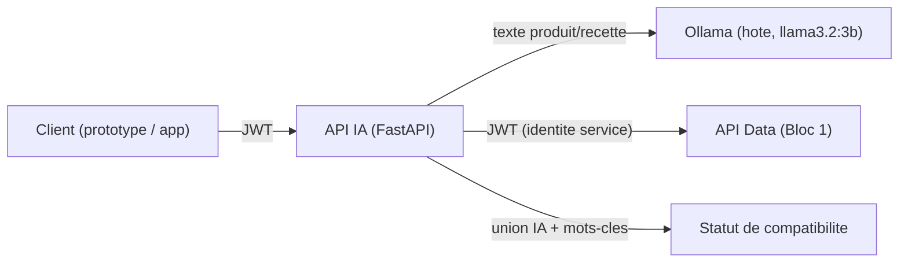

# API REST IA (C9) — S6

## Présentation

[`ai-service/api_ia/`](../../ai-service/api_ia) expose l'analyse de compatibilité allergène développée au POC (S5) sous forme d'API REST, consommée par le prototype ([`prototype.md`](prototype.md)) puis par l'application (Bloc 3). Construite avec **FastAPI** (documentation OpenAPI automatique sur `http://localhost:8011/docs`).

## Architecture



L'API IA orchestre deux appels externes par requête d'analyse : le modèle local (extraction) et l'API Data (récupération du produit/de la recette). Le calcul du statut de compatibilité (comparaison avec le profil transmis par l'appelant) reste local à l'API IA — voir [`extraction.py`](../../ai-service/api_ia/extraction.py).

## Endpoints

| Méthode | Route | Auth | Description |
|---|---|---|---|
| GET | `/health` | non | Vérifie que l'API est en ligne |
| POST | `/auth/token` | non | Émet un jeton d'accès (même schéma client credentials que l'API Data) |
| POST | `/analyser/texte` | oui | Analyse un texte libre par rapport à un profil allergène |
| POST | `/analyser/produit/{code_barres}` | oui | Récupère le produit via l'API Data puis l'analyse |
| POST | `/analyser/recette/{id_recette}` | oui | Récupère la recette via l'API Data puis l'analyse |

Corps de requête (`/analyser/*`) : `{"allergies_utilisateur": [{"libelle": "Lait", "niveau": "allergie"}], "texte": "..."}` (le champ `texte` n'existe que sur `/analyser/texte`). `niveau` ∈ `allergie` (→ statut `incompatible`), `intolerance`/`preference` (→ `a_risque`).

## Sécurité (OWASP API Top 10)

- **Authentification** (API2:2023) : JWT Bearer, identique au schéma de l'API Data.
- **Consommation de ressources non maîtrisée** (API4:2023) : chaque analyse déclenche une inférence sur le modèle local, coûteuse en temps de calcul — une limitation de débit (20 appels/60s par client, voir [`auth.py`](../../ai-service/api_ia/auth.py)) protège contre un usage abusif. Limite connue et documentée : compteur en mémoire, à remplacer par un compteur partagé (Redis) en cas de déploiement multi-instance.
- **Aucune donnée personnelle transmise au modèle** : seul le texte d'ingrédients (donnée publique) est envoyé à Ollama ; le profil allergène de l'appelant n'est comparé qu'en code déterministe, jamais inclus dans le prompt.
- **Gestion d'erreurs sans fuite d'information** : une panne de l'API Data renvoie `502` générique, jamais le détail interne de la panne au client.

## Tests automatisés

19 tests (`ai-service/api_ia/tests/`), exécution en ~4 secondes (aucun appel réseau réel : le modèle et l'API Data sont simulés) :

```bash
cd ai-service
py -m pytest api_ia/tests/ -v
# 19 passed
```

- `test_extraction.py` (8 tests) : logique métier réelle (détection par mots-clés, union IA + mots-clés, calcul du statut selon le niveau d'allergie, filtrage des allergènes hors référentiel halluciné par le modèle).
- `test_main.py` (11 tests) : contrat des endpoints — authentification requise/rejetée, 404 sur produit/recette absent, 502 si l'API Data est injoignable, 429 au-delà de la limite de débit.

Séparation volontaire : la **fiabilité du modèle** (précision/rappel) a été mesurée empiriquement lors du POC (S5, données réelles) plutôt que simulée dans des tests unitaires — un mock ne peut pas mesurer la qualité réelle d'une extraction IA.

## Vérification en conditions réelles

Au-delà des tests automatisés, la chaîne complète a été vérifiée avec la vraie stack Docker et le vrai modèle :

```bash
curl -X POST "http://localhost:8011/analyser/produit/0072417144592" \
  -H "Authorization: Bearer <token>" -H "Content-Type: application/json" \
  -d '{"allergies_utilisateur":[{"libelle":"Lait","niveau":"allergie"}]}'
# → statut_compatibilite: "incompatible" (Lait detecte par mots-cles, confirme par l'API Data)
```

## Interconnexion Docker ↔ Ollama

Ollama tourne sur la machine hôte (pas en conteneur, voir [`poc.md`](poc.md)) ; le conteneur `api_ia` le joint via `host.docker.internal` (résolu nativement par Docker Desktop, `extra_hosts: host-gateway` ajouté pour la portabilité Linux). `OLLAMA_BASE_URL` et `DATA_API_BASE_URL` sont paramétrables par variable d'environnement pour permettre le même code en développement local (`localhost`) et en conteneur (`host.docker.internal` / nom du service Docker).

## Installation et lancement

```bash
cp .env.example .env
ollama serve &            # ou service dedie
ollama pull llama3.2:3b
docker compose up -d --build
```

L'API est alors accessible sur `http://localhost:8011` (documentation interactive sur `/docs`).
