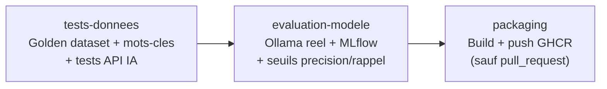

# Chaîne CI/CD MLOps (C13) — S8

## 1. Vue d'ensemble

[`.github/workflows/mlops-ci-cd.yml`](../../.github/workflows/mlops-ci-cd.yml) automatise, pour le service IA (Bloc 2), l'enchaînement validation → tests → packaging, dans une approche MLOps. Il réutilise directement les livrables de S7 : le golden dataset, les 3 niveaux de tests, et le script de monitoring MLflow — cette chaîne ne fait qu'orchestrer automatiquement ce qui a déjà été construit et vérifié manuellement.

Remarque sur le vocabulaire du référentiel : « entraînement du modèle » ne s'applique pas ici — le modèle (`llama3.2:3b` via Ollama) est pré-entraîné et utilisé tel quel (voir [benchmark-services-ia.md](benchmark-services-ia.md)). Les étapes couvertes sont donc **test des données**, **test/évaluation/validation du modèle**, et **packaging**.

## 2. Déclencheurs

| Déclencheur | Effet |
|---|---|
| `push` sur `main` (chemins `ai-service/**` ou le workflow lui-même) | Chaîne complète, jusqu'à la publication de l'image |
| `pull_request` vers `main` (mêmes chemins) | Tests et évaluation seulement — pas de publication depuis une branche non fusionnée |
| `workflow_dispatch` | Déclenchement manuel depuis l'onglet *Actions* de GitHub |

Le filtre de chemin (`paths:`) évite de relancer la chaîne du Bloc 2 lors d'une modification du Bloc 1 ou du Bloc 3.

## 3. Étapes (jobs)



1. **`tests-donnees`** : installe les dépendances, exécute les tests rapides (validation du golden dataset, détection par mots-clés, tests unitaires de l'API IA) — aucun appel réseau, ~10 s.
2. **`evaluation-modele`** : démarre un **conteneur de service** `ollama/ollama:latest` (fonctionnalité native GitHub Actions, pas d'installation manuelle), attend qu'il soit prêt, tire le modèle, exécute le script de monitoring (`monitoring.evaluer_modele`, journalise dans MLflow) puis le test de validation à seuils. Le rapport JSON et le suivi MLflow sont publiés comme artefacts téléchargeables.
3. **`packaging`** : construit l'image Docker de l'API IA et la publie sur **GitHub Container Registry (ghcr.io)**, authentifié avec `GITHUB_TOKEN` — jeton fourni automatiquement par GitHub Actions pour le dépôt courant, donc **aucun compte tiers à créer** (cohérent avec la contrainte posée dès le cadrage).

## 4. Vérification effectuée avant intégration

Un fichier de workflow ne peut être validé qu'en s'exécutant réellement — la stratégie de vérification suivie ici, par ordre de rigueur croissante :

1. **Syntaxe et graphe de jobs** : validés avec [`act`](https://github.com/nektos/act) (exécuteur GitHub Actions local), qui a immédiatement révélé une **vraie erreur de syntaxe YAML** (une commande `curl` contenant `{"name": ...}` sur une ligne `run:` en style court était mal interprétée par le parseur YAML comme le début d'un mapping imbriqué). Corrigée en passant cette étape en style bloc (`run: |`). `act -l` confirme ensuite les 3 jobs et leurs dépendances dans l'ordre attendu.
2. **Mécanique du conteneur de service Ollama** : vérifiée en lançant manuellement `ollama/ollama:latest` en conteneur Docker local — démarre et sert correctement sur le port attendu.
3. **Format exact de l'appel `POST /api/pull`** : vérifié contre la vraie instance Ollama du poste de développement (les deux formats de corps de requête, `{"name": ...}` et `{"model": ...}`, ont été testés et fonctionnent).
4. **Chaque étape individuelle** (installation des dépendances, exécution de pytest, build Docker avec le même `Dockerfile`/contexte) a déjà été exécutée avec succès dans les sessions précédentes (S6-S7) sous une forme équivalente.
5. **Limite assumée** : une exécution de bout en bout via `act` n'a pas pu être menée à son terme dans cet environnement de développement (le client Docker embarqué dans `act` renvoie une erreur 500 sur les appels d'inspection d'image — un problème de compatibilité entre `act` et cette installation locale de Docker Desktop, sans rapport avec le contenu du workflow lui-même : un `docker pull` classique de la même image réussit sans erreur). La vérification définitive interviendra au premier `git push` réel vers GitHub, sur des runners standards sans cette contrainte locale.

## 5. Sécurité et permissions

Le job `packaging` déclare explicitement des permissions minimales (`contents: read`, `packages: write`) plutôt que d'hériter des permissions par défaut du dépôt — principe de moindre privilège.

## 6. Installation et test en local

```bash
# Valider la syntaxe et le graphe de jobs sans tout executer :
act -l

# Executer un job precis (necessite Docker) :
act -j tests-donnees
```

## 7. Accessibilité

Ce document suit la structure accessible commune au projet (titres hiérarchiques, tableau à en-têtes explicites, diagramme Mermaid accompagné d'une description textuelle des étapes juste au-dessus).
