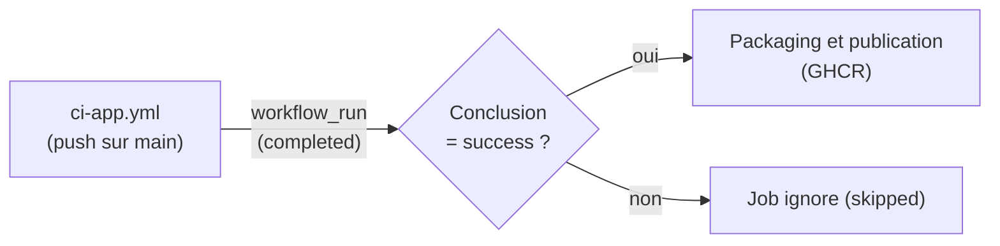

# Chaîne de livraison continue de l'application (C19) — S10

## 1. Vue d'ensemble

[`.github/workflows/cd-app.yml`](../../.github/workflows/cd-app.yml) construit et publie les images Docker du backend applicatif et du frontend Streamlit sur **GitHub Container Registry**, uniquement lorsque la CI ([`ci-app.yml`](ci.md)) a réussi sur `main`.

## 2. Portée du « déploiement pré-production » — décision documentée

Le planning ([`planning.md`](../00-pilotage/planning.md), S10) prévoit un « déploiement pré-prod ». Une mise en ligne réelle chez un hébergeur (Render, Railway, Fly.io…) nécessiterait de **créer un compte chez un tiers** — ce qui va à l'encontre du principe posé dès le choix du sujet ([`architecture.md`](../01-cadrage/architecture.md), §2) : zéro compte ni clé externe, précisément pour éviter tout risque de blocage administratif et renforcer la confidentialité des données de santé du profil allergène.

**Choix retenu (validé avec le porteur du projet)** : la CD publie des images Docker versionnées et immédiatement déployables sur **GitHub Container Registry**, avec le jeton `GITHUB_TOKEN` fourni automatiquement (même mécanisme que l'API IA en S8) — zéro nouveau compte. Le déploiement effectif chez un hébergeur reste une étape ultérieure explicitement documentée comme telle, plutôt que silencieusement escamotée. Cela satisfait la partie « build Docker » de la compétence C19 et livre un artefact réellement utilisable (`docker pull` + `docker run` sur n'importe quel hôte Docker), sans compromettre l'architecture zéro-compte du projet.

## 3. Déclencheurs et enchaînement avec la CI

Le déclencheur `workflow_run` (plutôt qu'un simple `push` dupliqué) garantit qu'aucune image n'est publiée si les tests n'ont pas réussi — c'est le sens même de séparer CI et CD en deux fichiers distincts plutôt que d'enchaîner aveuglément sur push. `workflow_dispatch` permet aussi un déclenchement manuel (ex. republier une image sans modification de code).

## 4. Étape (job)

**`packaging`** : connexion à `ghcr.io` avec `GITHUB_TOKEN`, calcul du nom de dépôt en minuscules (même correctif que S8 — `ghcr.io` exige un nom entièrement en minuscules, `github.repository_owner` ne l'est pas forcément), puis build + publication des deux images :

| Image | Contexte | Dockerfile |
|---|---|---|
| `ghcr.io/<compte>/nutriscan-app-backend` | `./app` | `app/backend/Dockerfile` |
| `ghcr.io/<compte>/nutriscan-app-frontend` | `./app` | `app/frontend/Dockerfile` |

Chaque image est taguée `:latest` et `:<sha du commit testé par la CI>` (traçabilité — voir §5, checkout explicite du bon commit).

Permissions minimales déclarées (`contents: read`, `packages: write`) plutôt qu'héritées par défaut du dépôt — même principe de moindre privilège que le packaging du Bloc 2.

## 5. Point d'attention : quel commit est réellement publié

Sur un déclenchement `workflow_run`, `github.sha` pointe par défaut sur l'état du dépôt au moment de l'évènement CD lui-même, pas nécessairement sur le commit réellement testé par le run CI déclencheur. Le job checkout donc explicitement `${{ github.event.workflow_run.head_sha }}`, et les tags d'image utilisent la même référence — pour que l'image publiée corresponde exactement au commit qui a été testé, jamais à un état plus récent du dépôt qui n'aurait pas encore été validé par la CI.

## 6. Vérification effectuée

- **Locale** : build des deux images (`docker build`), démarrage réel du conteneur frontend et vérification HTTP (voir [dev-application.md](dev-application.md)).
- **Réelle, sur GitHub Actions** :
  - Run `#1` (déclenché après l'échec du premier run de CI) : **`skipped`**, comme attendu — confirme que le gating `if: ... conclusion == 'success'` fonctionne réellement, pas seulement sur le papier.
  - Run `#2` (déclenché après le succès du run de CI corrigé) : **succès en 1m 24s**, les deux images construites et publiées.
  - Confirmé par une vérification indépendante de la page *Packages* du compte GitHub : `nutriscan-app-backend` et `nutriscan-app-frontend` y apparaissent bien, aux côtés de `nutriscan-api-ia` (Bloc 2, S8).

## 7. Accessibilité

Structure hiérarchique de titres, tableau à en-têtes explicites, diagrammes Mermaid accompagnés d'une description textuelle juste au-dessus — cohérent avec le reste de la documentation du projet.
