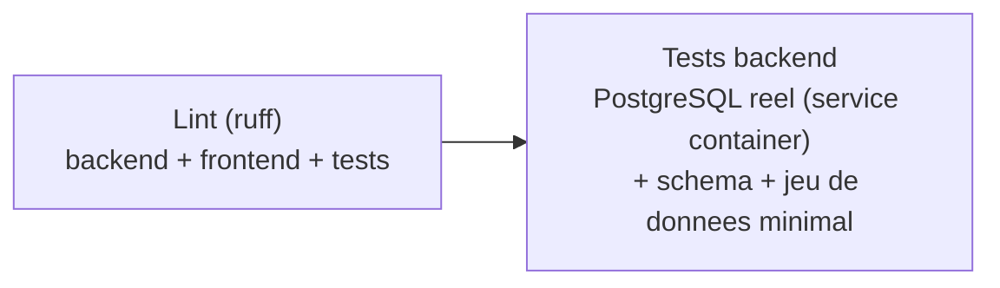

# Chaîne d'intégration continue de l'application (C18) — S10

## 1. Vue d'ensemble

[`.github/workflows/ci-app.yml`](../../.github/workflows/ci-app.yml) automatise l'analyse statique et les tests automatisés du backend applicatif (`app/backend/`, voir [dev-application.md](dev-application.md)). Fichier distinct de [`mlops-ci-cd.yml`](../03-bloc2-ia/cicd-mlops.md) (Bloc 2, S8) : les deux compétences (C13 MLOps vs C18 CI applicative) sont évaluées séparément, et le planning ([`planning.md`](../00-pilotage/planning.md), S10) attend deux fichiers dédiés à l'application (`ci-app.yml` / `cd-app.yml`).

## 2. Déclencheurs

| Déclencheur | Effet |
|---|---|
| `push` sur `main` (chemins `app/**` ou le workflow lui-même) | Lint + tests |
| `pull_request` vers `main` (mêmes chemins) | Lint + tests, sans publication (pas d'étape de publication dans ce fichier de toute façon) |
| `workflow_dispatch` | Déclenchement manuel |

## 3. Étapes (jobs)



1. **`lint`** : analyse statique avec [ruff](https://docs.astral.sh/ruff/), configuré dans [`app/pyproject.toml`](../../app/pyproject.toml). Périmètre volontairement restreint (`select = ["E", "F", "I"]` : erreurs réelles pyflakes, style de base pycodestyle, tri des imports) — la règle de modernisation `UP045` (qui suggérerait `X | None` au lieu de `typing.Optional`) est explicitement exclue : ce projet cible aussi Python 3.9 en développement local, et `X | None` casse à l'exécution dans les modèles Pydantic sous 3.9 (voir `data-pipeline/api_data/schemas.py`, `app/backend/schemas.py`).
2. **`tests-backend`** : démarre un **conteneur de service** `postgres:16-alpine` (même mécanique que le conteneur Ollama de S8), applique le schéma (`data-pipeline/db/schema.sql`) et sème un produit de test minimal, puis exécute les 33 tests de `app/backend/tests/` (14 unitaires sans IO + 19 d'intégration contre la vraie base).

### Pourquoi semer un produit de test

Un service container GitHub Actions démarre **avant** le checkout du dépôt : contrairement à `docker-compose.yml` (qui monte `schema.sql` via `docker-entrypoint-initdb.d` au premier démarrage local), il est impossible de monter le fichier de schéma au démarrage du service en CI. Le schéma est donc appliqué explicitement dans une étape dédiée, avec `psycopg2` (déjà une dépendance de `backend/requirements.txt`) plutôt qu'en ajoutant une dépendance système (`postgresql-client`) pour ce seul usage. Sans donnée en base, les tests d'historique/export liés à un code-barres réel seraient silencieusement ignorés (la fixture `code_barres_existant` de `test_main.py` fait un `pytest.skip` si aucun produit n'existe) — un produit minimal est donc semé pour que ces tests s'exécutent réellement en CI plutôt que d'être ignorés par confort.

## 4. Vérification effectuée avant intégration

`act` (utilisé en S8 pour valider la syntaxe/le graphe de jobs localement) n'était pas disponible dans cet environnement de développement au moment de ce sprint. Vérification alternative, plus poussée que ce qu'`act -l` aurait offert :

1. **Lint** : exécuté localement avec la commande exacte de la CI (`ruff check backend frontend tests`) — a trouvé 2 imports inutilisés réels, corrigés.
2. **Simulation complète du job `tests-backend`** : conteneur PostgreSQL jetable démarré localement (image identique, `postgres:16-alpine`), schéma appliqué et produit semé avec le code exact de l'étape CI, puis les 33 tests exécutés contre cette base vierge — reproduit fidèlement un environnement CI propre plutôt qu'une base de développement déjà peuplée.
3. **Build Docker** des deux images (`app/backend/Dockerfile`, `app/frontend/Dockerfile`) et démarrage réel du conteneur frontend, vérifié par une requête HTTP.

### Premier run réel : échec trouvé, corrigé, deuxième run réussi

Le premier `git push` déclenche un vrai run (`#1`) : le job `lint` réussit (8s), mais `tests-backend` échoue en 28s dès la collecte des tests :

```
RuntimeError: The starlette.testclient module requires the httpx2 package to be installed.
You can install this with:
    $ pip install httpx2
```

Cause : la version de Starlette résolue par pip en CI (fraîchement installée, contrainte `fastapi>=0.115` non figée) est une version majeure 1.x dont `TestClient` s'appuie sur un nouveau paquet `httpx2` plutôt que sur l'ancien `httpx` — absent de `app/backend/requirements.txt`. Le poste de développement local avait une version de Starlette antérieure à ce changement (0.49.3), ce qui masquait le problème, exactement le même type de décalage qui avait révélé le bug MLflow du premier run CI/CD du Bloc 2 (S8). Corrigé en ajoutant `httpx2>=2.0` (et `pytest>=8.0`, jusque-là installé séparément) à `app/backend/requirements.txt` — convention déjà appliquée dans `ai-service/requirements.txt` (`pytest`, `httpx` y sont déjà listés).

Le run `#2` confirme le correctif : **succès complet en 43s** (lint 9s, tests backend 34s, 33/33 tests passés).

## 5. Accessibilité

Structure hiérarchique de titres, tableau à en-têtes explicites, diagramme Mermaid accompagné d'une description textuelle des étapes juste au-dessus — cohérent avec le reste de la documentation du projet.
