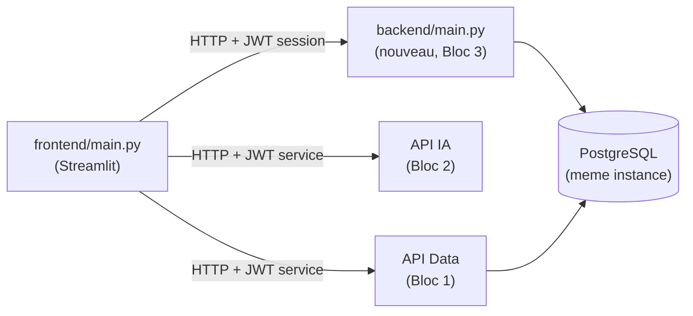

# Application complète NutriScan IA (C17) — S9

## 1. Vue d'ensemble

L'application du Bloc 3 couvre les user stories US1 à US9 ([`user-stories.md`](../01-cadrage/user-stories.md)) : compte utilisateur, profil allergène persistant, recherche de produits/recettes avec alerte de compatibilité, score nutritionnel détaillé, historique, et maîtrise des données personnelles (RGPD).

Le prototype de S6 ([`frontend/prototype.py`](../../app/frontend/prototype.py), voir [prototype.md](../03-bloc2-ia/prototype.md)) démontrait déjà l'intégration de l'API IA dans une interface, mais sans compte ni persistance — le profil était ressaisi à chaque session. L'application complète construite ici (`frontend/main.py`) ajoute la couche manquante : un compte réel, un profil sauvegardé et chiffré, un historique, et les droits RGPD.

## 2. Architecture : un composant backend de plus, pas une base partagée en accès direct

[`architecture.md`](../01-cadrage/architecture.md) décrivait à l'origine l'application comme un unique bloc « Streamlit (front + back) ». En construisant réellement la persistance (S9), un découpage plus fin s'est imposé, pour rester cohérent avec le principe déjà appliqué aux deux autres blocs : **un frontend ne se connecte jamais directement à une base de données, il appelle une API**.



- **`app/backend/`** (nouveau, C17) : service FastAPI qui possède et est seul à écrire les tables de données personnelles (`utilisateur`, `utilisateur_allergene`, `analyse_compatibilite`, `traitement_rgpd`, déjà modélisées en S3 pour C4 mais jamais écrites avant cette semaine). Il partage la même instance PostgreSQL que `data-pipeline` (un seul conteneur `postgres`, voir `docker-compose.yml`) mais ne touche jamais aux tables du catalogue (`produit`, `recette`, ...), exclusivement gérées par l'API Data — la séparation « aucun composant n'accède directement à la base d'un autre » (`architecture.md`, §2) est donc appliquée **par table**, pas seulement par instance physique.
- **`app/frontend/main.py`** : ne se connecte à aucune base ; appelle les trois API (Data, IA, backend applicatif) exactement de la même façon.

Ce découpage a aussi permis de tester et documenter le backend applicatif exactement comme les deux autres API (Dockerfile, tests, `/docs` OpenAPI), plutôt que de mélanger logique métier et rendu dans un seul script Streamlit.

## 3. Backend applicatif (`app/backend/`)

Documentation interactive : `http://localhost:8012/docs`.

| Endpoint | US | Détail |
|---|---|---|
| `POST /auth/inscription` | US1 | email + mot de passe + deux consentements RGPD distincts et obligatoires |
| `POST /auth/connexion` | US1 | renvoie un jeton de session (60 min) |
| `GET`/`PUT /profil` | US2 | profil allergène, chiffré en base (pgcrypto), horodaté |
| `GET`/`POST /historique` | US7 | historique des analyses produit/recette (pas le texte libre, voir §5) |
| `GET /rgpd/export` | US8 | export JSON complet (compte, profil, historique) |
| `DELETE /rgpd/compte` | US8 | suppression définitive, confirmation par ressaisie de l'email |

### Sécurité (OWASP Top 10 Web / API Top 10)

- **Mots de passe** : hachés avec `bcrypt` (jamais stockés en clair), robustesse minimale imposée (10 caractères, lettre + chiffre).
- **Anti-énumération de comptes** : `/auth/connexion` renvoie le même code et le même message (`401`) qu'un email soit inconnu ou qu'un mot de passe soit incorrect ; en cas d'email inconnu, une vérification bcrypt est tout de même exécutée contre un hash factice pour que le temps de réponse ne révèle pas non plus l'existence du compte.
- **Anti-bruteforce (OWASP API4:2023)** : fenêtre glissante en mémoire, 5 échecs / 15 min par email avant `429` — même principe que la limitation de débit de l'API IA (`ai-service/api_ia/auth.py`), déjà éprouvée en S6.
- **Jeton de session dédié** : `APP_JWT_SECRET_KEY`, distinct de `JWT_SECRET_KEY` (utilisé pour l'authentification service-à-service des API Data/IA) — un jeton de session utilisateur compromis ne peut pas être rejoué comme jeton de service, et inversement.
- **Chiffrement au repos** : le niveau (allergie/intolérance/préférence) de `utilisateur_allergene` est chiffré avec `pgcrypto` (`pgp_sym_encrypt`/`pgp_sym_decrypt`), clé fournie par variable d'environnement (`RGPD_ENCRYPTION_KEY`), jamais stockée en base — conforme au choix posé dès S3.
- **Suppression de compte à double confirmation (US8)** : la case à cocher « je comprends » ET la ressaisie exacte de l'email sont exigées ; testé dans le navigateur avec une mauvaise confirmation (rejetée) puis la bonne (acceptée).
- **Permissions minimales** : chaque route protégée dépend de `utilisateur_courant()`, qui n'autorise l'accès qu'aux données du titulaire du jeton (aucun paramètre d'ID utilisateur n'est jamais accepté en entrée).

### Bug réel trouvé en testant : `passlib` incompatible avec `bcrypt` récent

Le choix initial (`passlib[bcrypt]`, prévu dès S3 dans `data-pipeline/requirements.txt` sans jamais être utilisé) a échoué au tout premier démarrage :

```
ValueError: password cannot be longer than 72 bytes, truncate manually if necessary
```

Cause : un bug connu de compatibilité entre `passlib` 1.7.4 (dernière version stable, non maintenue depuis) et les versions récentes de `bcrypt` (5.x) — la routine interne de détection de bug hérité de `passlib` échoue avant même le premier hachage réel. Corrigé en abandonnant `passlib` au profit d'un usage direct de la bibliothèque `bcrypt` (plus simple, activement maintenue, aucune couche d'abstraction inutile puisqu'un seul algorithme est utilisé) — trouvé et corrigé en testant réellement le service, pas en anticipant.

## 4. Frontend (`app/frontend/main.py`)

Pages : Connexion/Inscription → Mon profil → Rechercher un produit/une recette → Texte libre → Historique → Mes données (RGPD), navigation par barre latérale, session maintenue via `st.session_state`.

### Bug réel trouvé en testant : `st.form` et widgets conditionnels

La page « Mon profil » affiche un sélecteur de niveau (allergie/intolérance/préférence) uniquement si la case de l'allergène correspondant est cochée. Une première version plaçait l'ensemble dans un `st.form` (comme les formulaires de connexion/inscription, sans dépendance dynamique entre widgets). En testant dans le navigateur : cocher une case ne faisait *jamais* apparaître le sélecteur de niveau avant de cliquer sur « Enregistrer ». Cause : Streamlit ne relance le script (`rerun`) qu'à la soumission d'un `st.form`, jamais à l'interaction avec un widget individuel qu'il contient — un sélecteur dont l'affichage dépend d'un autre widget du même formulaire ne peut donc jamais apparaître avant la soumission elle-même. Corrigé en sortant le profil du `st.form` (widgets au niveau racine de la page, chacun déclenchant son propre rerun) avec un bouton simple à la place d'un `form_submit_button`. Revérifié dans le navigateur après correction : le sélecteur apparaît immédiatement.

### Score nutritionnel détaillé (US6)

- **Produit** : valeurs Open Food Facts pour 100g/100ml (énergie, protéines, glucides, lipides) — champ `nutriments` déjà récupéré par `extract/openfoodfacts_api.py` depuis S2 mais jamais persisté avant cette semaine (voir §6).
- **Recette** : somme (non pondérée par les quantités) des valeurs Ciqual des ingrédients reconnus, avec le taux de couverture affiché (ex. « 10/12 ingrédients reconnus ») — transparence explicite sur la limite de l'approximation, conformément au critère US6 sur la traçabilité de l'origine de chaque donnée.

### Accessibilité (WCAG 2.1 AA)

- Chaque champ de formulaire porte un `label` explicite passé au widget Streamlit (jamais de `label_visibility="collapsed"`) — vérifié via l'arbre d'accessibilité du navigateur : chaque `textbox`/`checkbox`/`radio` expose son nom accessible complet.
- US2 : une case à cocher native par allergène (`J'ai une réaction à : {libellé}`), pas une liste déroulante multi-sélection — chaque case a son propre `label` associé, vérifié dans l'arbre d'accessibilité.
- US4 : le statut de compatibilité n'est jamais communiqué par la seule couleur : icône (✅/⚠️/⛔) + texte explicite systématiquement affichés ensemble.
- US7 : l'historique utilise `st.table` (rendu en `<table>` HTML natif avec en-têtes de colonnes), pas le composant grille interactif (`st.dataframe`) moins accessible aux lecteurs d'écran.
- US1 : les deux cases de consentement RGPD sont décochées par défaut (comportement natif de `st.checkbox`) et étiquetées individuellement.

## 5. Limites assumées (documentées, pas masquées)

- **Historique et texte libre** : la table `analyse_compatibilite` exige un produit OU une recette (contrainte `chk_analyse_produit_ou_recette`, posée en S3) — une analyse de texte libre ne peut donc pas être historisée (aucune entité à laquelle la rattacher). Annoncé explicitement à l'utilisateur dans l'onglet « Texte libre ».
- **Rapprochement Ciqual** : heuristique légère par mot-clé significatif (voir §6), pas une résolution sémantique complète — le taux de couverture réel (~80 % sur le corpus de recettes) est affiché à l'utilisateur plutôt que masqué.
- **Anti-bruteforce en mémoire** : mono-instance, comme pour l'API IA (S6) ; une mise à l'échelle multi-instance nécessiterait un compteur partagé (ex. Redis).
- **Traçabilité RGPD (`traitement_rgpd`) et suppression de compte** : la table est en cascade sur `utilisateur` (`ON DELETE CASCADE`) : le journal de traçabilité d'un compte ne survit donc pas à sa suppression. Recevable pour un projet pédagogique, mais un système visant une accountability (art. 5.2 RGPD) pleinement durable exporterait ce journal avant suppression ou le stockerait hors cascade — hors périmètre de cette version.

## 6. Enrichissement Bloc 1 nécessaire à US6 (fait en amont, S9)

En construisant le score nutritionnel détaillé, deux lacunes du Bloc 1 sont apparues et ont été comblées avant de coder le Bloc 3 :

1. **Nutriments produits jamais persistés** : `extract/openfoodfacts_api.py` récupère déjà le champ `nutriments` d'Open Food Facts depuis S2, mais `transform/clean_aggregate.py` ne le reportait pas dans `produits.json`, et `db/schema.sql` n'avait pas de colonne pour l'accueillir. Ajout de 4 colonnes (`energie_kcal_100g`, `proteines_g_100g`, `glucides_g_100g`, `lipides_g_100g`) à `produit`, extraction dans `clean_aggregate.py`, insertion dans `load/import_data.py`. Aucune nouvelle collecte réseau nécessaire (donnée déjà sur disque) — vérifié : 24/26 produits ont désormais des valeurs.
2. **Ingrédients de recette jamais rapprochés de Ciqual** : `load/import_data.py` laissait volontairement `ingredient.code_ciqual` à `NULL` depuis S2, ce rapprochement étant hors périmètre d'un import brut. Ajout d'une heuristique légère (`matcher_code_ciqual`, mot-clé significatif après normalisation accents/casse/unités) dans `load/import_data.py`, testée sur les données réelles : **66/82 ingrédients (80 %)** rapprochés d'un aliment Ciqual.

## 7. Vérification effectuée

- **Automatisée** : `app/backend/tests/test_security.py` (14 tests, purs, sans IO — hachage, JWT, robustesse mot de passe, anti-bruteforce) et `app/backend/tests/test_main.py` (19 tests d'intégration contre la vraie base PostgreSQL, chaque test crée puis supprime son propre compte). **33/33 tests passent.**
- **Manuelle, en conditions réelles, dans le navigateur** (`docker compose up -d postgres api_data api_ia app_backend` + Ollama local) : inscription → connexion → profil (persistance et chiffrement vérifiés en base par requête SQL directe) → recherche produit avec analyse IA réelle et alerte cohérente avec le niveau déclaré (« Intolérance » → « À risque », pas « Incompatible ») → score nutritionnel produit → recherche recette avec score nutritionnel agrégé Ciqual → historique → export RGPD → suppression de compte à double confirmation (mauvaise confirmation rejetée, bonne acceptée, suppression vérifiée en base).
- Les deux bugs réels documentés ci-dessus (§3 et §4) ont été trouvés par cette vérification manuelle, pas anticipés.

## 8. Installation et lancement

```bash
# Backend et API dependantes
docker compose up -d postgres api_data api_ia app_backend

# Modele IA local
ollama serve

# Frontend
cd app
py -m streamlit run frontend/main.py
```

## 9. Accessibilité de ce document

Structure hiérarchique de titres, tableau à en-têtes explicites, diagramme Mermaid accompagné d'une description textuelle des flux juste au-dessus — cohérent avec la structure documentaire du reste du projet.
