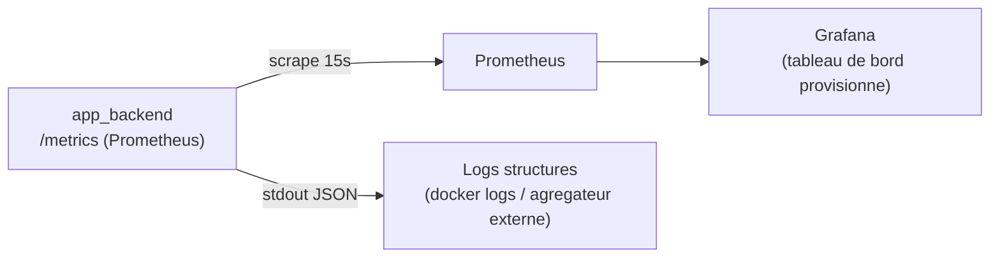

# Monitoring applicatif (C20) — S11

## 1. Vue d'ensemble

Le backend applicatif (`app/backend/`, C17) journalise ses évènements et expose ses métriques opérationnelles, collectées par **Prometheus** et visualisées dans **Grafana** — les deux autohébergés via `docker-compose.yml`, cohérent avec le principe « zéro compte/service cloud tiers » posé dès le cadrage ([architecture.md](../01-cadrage/architecture.md)).

Ce monitoring cible spécifiquement `app_backend` (Bloc 3), le composant réellement développé et possédé dans ce sprint. Le service IA (Bloc 2, `api_ia`) reste couvert par son propre suivi qualité (MLflow, S7 — voir [monitoring-modele.md](../03-bloc2-ia/monitoring-modele.md)), qui répond à un besoin différent (qualité de détection du modèle, pas santé opérationnelle du service).



## 2. Journalisation structurée (`app/backend/common/logging_config.py`)

Format JSON (une ligne par évènement), pour une ingestion directe par un outil d'agrégation de logs sans expression régulière fragile. Évènements journalisés : `inscription`, `connexion_reussie`, `connexion_echouee`, `profil_mis_a_jour`, `historique_ajoute`, `export_rgpd`, `suppression_compte`.

**Règle de confidentialité stricte** (voir [registre-traitements.md](../rgpd/registre-traitements.md)) : aucun secret (mot de passe, jeton) ni aucune donnée de santé en clair (libellé d'allergène, niveau) n'apparaît dans les logs — uniquement des métadonnées opérationnelles (type d'évènement, identifiant utilisateur, compteurs). Par exemple, `profil_mis_a_jour` journalise le *nombre* d'allergènes déclarés, jamais lesquels.

Vérifié en conditions réelles : une inscription puis une connexion échouée produisent bien ces deux lignes JSON exactes, sans aucune donnée sensible :
```json
{"timestamp": "2026-08-06T11:04:52+0000", "niveau": "INFO", "logger": "nutriscan.backend", "evenement": "inscription", "id_utilisateur": 79}
{"timestamp": "2026-08-06T11:04:53+0000", "niveau": "INFO", "logger": "nutriscan.backend", "evenement": "connexion_echouee"}
```

## 3. Métriques Prometheus (`GET /metrics`)

| Métrique | Type | Description |
|---|---|---|
| `nutriscan_backend_requetes_total{methode,chemin,statut}` | Counter | Nombre de requêtes HTTP reçues |
| `nutriscan_backend_duree_requete_secondes{methode,chemin}` | Histogram | Durée de traitement des requêtes |
| `nutriscan_backend_inscriptions_total` | Counter | Comptes créés |
| `nutriscan_backend_connexions_reussies_total` / `..._echouees_total` | Counter | Connexions réussies / échouées (pic anormal = alerte bruteforce potentielle) |
| `nutriscan_backend_profils_maj_total` | Counter | Mises à jour du profil allergène |
| `nutriscan_backend_historique_ajouts_total{statut_compatibilite}` | Counter | Analyses historisées, par statut — reflète indirectement l'usage du service IA (Bloc 2) |
| `nutriscan_backend_exports_rgpd_total` / `..._suppressions_compte_total` | Counter | Exercices des droits RGPD (US8) |

Aucun paramètre d'URL dans les routes de ce backend (`/profil`, `/historique`, ...) : l'étiquette `chemin` ne présente aucun risque de cardinalité incontrôlée.

## 4. Tableau de bord Grafana

Provisionné automatiquement au démarrage (`app/monitoring/grafana/provisioning/`, `app/monitoring/grafana/dashboards/nutriscan-backend.json`) — reproductible par `docker compose up`, aucune configuration manuelle dans l'interface. Panneaux : requêtes par statut, latence p95 par route, taux d'erreur 5xx, connexions échouées (fenêtre 5 min), compteurs cumulés (inscriptions, exports RGPD, suppressions), et analyses historisées par statut de compatibilité.

**Seuils indicatifs** (à ajuster avec des données de production réelles) :
- Taux d'erreur 5xx > 5 % : anomalie à investiguer.
- Latence p95 > 3 s sur une route hors analyse IA (`/profil`, `/historique`, ...) : dégradation à surveiller (ces routes ne font qu'une requête SQL simple).
- Connexions échouées > 30 sur 5 min pour un volume d'utilisateurs faible : signe possible de bruteforce (au-delà de la protection déjà en place par compte, voir `security.py`).

### Vérification effectuée

- **Chaîne de collecte** : confirmée de bout en bout — cible Prometheus `nutriscan-app-backend` à l'état `up` (`/api/v1/targets`), requête réelle sur `nutriscan_backend_inscriptions_total` exécutée avec succès depuis Grafana *Explore* (données réelles retournées).
- **Provisionnement Grafana** : confirmé via l'API Grafana — la source de données `Prometheus` et le tableau de bord `NutriScan IA — Backend applicatif` (8 panneaux) sont créés automatiquement au démarrage, sans étape manuelle.
- **Bug réel trouvé et corrigé** : l'image `grafana/grafana:latest` a résolu vers une version dont le rendu du quadrillage de panneaux ne s'affichait pas (même un panneau texte sans requête restait vide), alors que les pages de contenu simple (connexion, liste des tableaux de bord, *Explore*) fonctionnaient normalement. Corrigé en épinglant une version stable connue (`grafana/grafana:11.1.0`) plutôt que `:latest` — bonne pratique de toute façon pour la reproductibilité, indépendamment du bug.
- **Limite de vérification assumée** : le rendu visuel final du quadrillage de panneaux (graphiques effectivement dessinés) n'a pas pu être confirmé dans le navigateur automatisé utilisé pour les tests de ce projet — son outil de capture d'écran échoue systématiquement dans cet environnement (« the Browser pane is not displayed, so the page is not compositing frames »), ce qui est cohérent avec l'hypothèse que le rendu par mesure de dimensions réelles (nécessaire à la grille de panneaux Grafana) est indisponible tant que la fenêtre n'est pas activement affichée à l'utilisateur. Tout le reste de la chaîne (collecte, stockage, requêtage, provisionnement) a été vérifié avec succès ; seule la confirmation visuelle finale reste à faire dans un navigateur usuel (`docker compose up -d prometheus grafana` puis `http://localhost:3000`, identifiants dans `.env`).

## 5. Accessibilité

Structure hiérarchique de titres, tableaux à en-têtes explicites, diagramme Mermaid accompagné d'une description textuelle des flux juste au-dessus — cohérent avec le reste de la documentation du projet.
