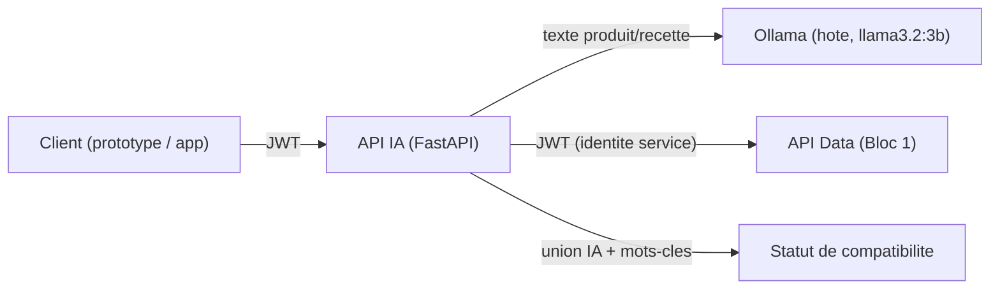

# Rapport professionnel — Épreuve E3 (Mise en situation, C9-C13)

**Projet** : NutriScan IA — assistant de compatibilité alimentaire (allergies/intolérances)
**Bloc** : B2 — Intégration d'un service d'intelligence artificielle
**Semaines** : S6-S8 · **Compétences** : C9 (API REST exposant un service IA), C10 (intégration dans une application prototype), C11 (monitoring du modèle), C12 (tests automatisés du modèle), C13 (chaîne CI/CD MLOps)

## Sommaire

1. Contexte et suite du Bloc 2
2. C9 — API REST exposant le service IA
3. C10 — Intégration dans une application prototype
4. C11 — Monitoring du modèle
5. C12 — Tests automatisés du modèle
6. C13 — Chaîne CI/CD MLOps
7. Grille d'auto-évaluation par compétence
8. Synthèse transversale
9. Limites assumées et perspectives
10. Conclusion

---

## 1. Contexte et suite du Bloc 2

Le rapport E2 a établi que le service IA retenu (Ollama, modèle `llama3.2:3b`) est fonctionnellement intégrable mais insuffisamment fiable seul (rappel de 33 % sur le test de faisabilité) pour un cas d'usage où un allergène manqué a une conséquence de sécurité réelle. La décision qui en découle — coupler l'IA à une recherche par mots-clés déterministe et retenir l'union des deux détections — est le fil conducteur technique de tout ce second cas pratique : elle est implémentée (C9), exposée à une interface (C10), mesurée dans la durée (C11), verrouillée par des tests (C12), et automatisée dans une chaîne de livraison (C13).

## 2. C9 — API REST exposant le service IA

### 2.1 Conception et architecture

`ai-service/api_ia/` (FastAPI, documentation OpenAPI sur `/docs`) orchestre deux appels externes par requête d'analyse : le modèle local (extraction) et l'API Data du Bloc 1 (récupération du produit ou de la recette à analyser). Le calcul du statut de compatibilité reste toujours local et déterministe.

Trois routes d'analyse (`/analyser/texte`, `/analyser/produit/{code_barres}`, `/analyser/recette/{id_recette}`) partagent le même calcul de compatibilité, avec un niveau (`allergie` → `incompatible`, `intolerance`/`preference` → `a_risque`) transmis par l'appelant plutôt que déduit — l'API IA n'a jamais besoin de connaître le profil complet d'un utilisateur, seulement la liste pertinente pour l'analyse en cours.

### 2.2 Sécurité (OWASP API Top 10)

- **Authentification (API2:2023)** : JWT Bearer, même schéma *client credentials* que l'API Data — cohérence délibérée entre les deux API du système plutôt que deux mécanismes différents sans raison.
- **Consommation de ressources non maîtrisée (API4:2023)** : chaque analyse déclenche une inférence sur un modèle local, coûteuse en temps de calcul. Une limitation de débit (20 appels/60 s par client) protège contre un usage abusif — limite connue documentée explicitement : le compteur est en mémoire (mono-instance), un déploiement à plusieurs instances nécessiterait un compteur partagé (Redis).
- **Minimisation des données transmises au modèle** : seul le texte d'ingrédients (donnée publique) est envoyé à Ollama ; le profil allergène de l'appelant n'est comparé qu'en code déterministe, jamais inclus dans le prompt — décision de conception directement issue de la contrainte de confidentialité posée en E2.
- **Gestion d'erreurs sans fuite d'information** : une panne de l'API Data renvoie un `502` générique au client (voir cependant §8, une régression sur ce principe a été trouvée et corrigée en S11 côté application).

### 2.3 Tests et vérification en conditions réelles

19 tests automatisés (`ai-service/api_ia/tests/`, ~4 secondes, sans appel réseau réel) couvrent la logique métier (détection par mots-clés, union IA + mots-clés, calcul du statut, filtrage des allergènes hallucinés hors référentiel) et le contrat des endpoints (authentification, 404, 502, 429). Séparation volontaire et assumée : la fiabilité **du modèle lui-même** n'est pas testée ici par des mocks — un mock ne peut pas mesurer la qualité réelle d'une extraction IA — mais empiriquement, avec de vraies données (voir C11-C12).

Au-delà des tests automatisés, la chaîne complète a été vérifiée avec la vraie stack Docker et le vrai modèle (`curl` sur `/analyser/produit/...`, résultat cohérent avec l'allergène réellement présent), et l'interconnexion conteneur ↔ hôte (`host.docker.internal` pour joindre Ollama, qui tourne sur la machine hôte et non en conteneur) a été validée en conditions réelles plutôt que supposée fonctionner par analogie avec la documentation Docker.

## 3. C10 — Intégration dans une application prototype

### 3.1 Objectif du prototype

`app/frontend/prototype.py` (Streamlit) démontre l'intégration de l'API IA et de l'API Data dans une interface utilisateur réelle, sans encore de compte ni de persistance (traité en Bloc 3, S9) : le profil allergène est saisi à chaque session. Le prototype ne contient aucune logique métier propre — il consomme strictement les deux API existantes, ce qui vérifie en creux que ces API sont réellement suffisantes pour construire une interface, pas seulement conformes sur le papier.

### 3.2 Adaptations d'accessibilité

- Le statut de compatibilité n'est **jamais porté par la seule couleur** : icône + libellé texte explicite (`✅ Compatible` / `⚠️ À risque` / `⛔ Incompatible`), conformément à l'US4 du cadrage.
- L'avertissement produit (« ne constitue pas un avis médical ») reste affiché en permanence.
- Le détail de la détection (IA vs mots-clés, justification du modèle) est exposé dans une section repliable — transparence de la décision algorithmique sans surcharger l'affichage principal.

### 3.3 Bugs réels découverts et corrigés pendant les tests manuels

Le prototype a été testé manuellement dans un navigateur avant d'être considéré fonctionnel — c'est cet exercice, pas une relecture du code, qui a révélé deux problèmes réels :

1. **Timeout trop court.** Premier essai en échec (`Read timed out (timeout=30)`) : une inférence Ollama après rechargement à froid du modèle peut dépasser 30 secondes. Corrigé en portant le timeout des appels d'analyse à 90 s, avec un `st.spinner` explicite prévenant l'utilisateur.
2. **Angle mort multilingue — faux négatif de sécurité.** Le produit test choisi a des ingrédients en **allemand** (« Milch », « Weizenmehl »). Ni le modèle ni le dictionnaire de mots-clés (FR/EN seulement) n'ont détecté le lait : le prototype affichait « Compatible » pour un profil allergique au lait. Corrigé en étendant le dictionnaire de synonymes avec les termes allemands courants — correctif qui a lui-même immédiatement révélé un second bug (le terme allemand ajouté pour « œuf », « ei », trop court, déclenchait un faux positif par sous-chaîne sur des mots sans rapport comme « Speisesalz ») corrigé à son tour par des formes plus longues et sûres.

Ce cas concret — pas hypothétique — renforce a posteriori la décision hybride prise en E2 : c'est le filet de mots-clés, pas le modèle, qui aurait dû détecter ce lait, et son absence de couverture linguistique a directement causé un faux négatif de sécurité en conditions réelles.

## 4. C11 — Monitoring du modèle

### 4.1 Métriques suivies et justification

| Métrique | Pourquoi elle est pertinente ici |
|---|---|
| Précision | Un faux positif fréquent use la confiance de l'utilisateur dans l'outil |
| **Rappel** | Un allergène manqué a une conséquence de sécurité réelle — métrique la plus critique du projet |
| Faux positifs/négatifs (comptes bruts) | Distingue une erreur diffuse d'un cas unique problématique |
| Latence moyenne/médiane/max | Le modèle tourne en local : la latence dépend directement des ressources de la machine |

Ces métriques sont calculées sur le même golden dataset que celui utilisé pour les tests automatisés (C12) : un seul outil de mesure sert à la fois de porte de qualité (tests) et de suivi dans le temps (monitoring), plutôt que deux implémentations séparées qui pourraient diverger.

### 4.2 Outil retenu

**MLflow** : gratuit, aucun compte requis, stockage local par fichiers, tableau de bord web natif sans configuration supplémentaire, conçu pour comparer plusieurs exécutions dans le temps — exactement le besoin ici (mesurer l'effet d'une modification du prompt ou du dictionnaire).

### 4.3 Découverte réelle : un biais du modèle

Premier run réel (`ai-service/monitoring/evaluer_modele.py`), résultat sur le golden dataset :

| Métrique | Valeur |
|---|---|
| Précision | 67 % |
| Rappel | 100 % |
| VP / FP / FN | 12 / 6 / 0 |
| Latence moyenne | 17,8 s |

Le monitoring a révélé un **biais systématique de sur-détection du gluten** par `llama3.2:3b` : 5 des 6 faux positifs de cette exécution concernaient le gluten, y compris sur un jus de fruits sans aucun rapport. Sur ce jeu de données, le filet de mots-clés seul atteint 100 % de précision **et** de rappel — l'IA n'apporte, à ce stade, aucun bénéfice de rappel et dégrade la précision globale. Ce constat, obtenu par la mesure et non anticipé, est exactement le type de découverte qu'un monitoring de modèle doit permettre — et illustre concrètement pourquoi le référentiel exige cette compétence séparément du simple test de non-régression.

Recommandations consignées pour la suite (hors périmètre de S7, arbitrage explicite) : tester un autre modèle, affiner le prompt pour ce cas précis, ou à défaut retirer l'IA du calcul et ne conserver que les mots-clés — décision qui, si elle était prise, changerait l'architecture actée en S5-S6 et devrait être documentée comme telle plutôt qu'appliquée silencieusement.

### 4.4 Restitution et accessibilité

Trois canaux de restitution complémentaires plutôt qu'un seul : le tableau de bord MLflow (vérifié fonctionnel en conditions réelles), un rapport JSON versionné en artefact (MLflow étant un outil tiers dont la conformité WCAG n'a pas été auditée, ce rapport structuré reste exploitable par un lecteur d'écran indépendamment de l'interface web), et la documentation elle-même.

## 5. C12 — Tests automatisés du modèle

### 5.1 Stratégie à trois niveaux

| Niveau | Portée | Vitesse | Réseau |
|---|---|---|---|
| 1. Validation des données | Cohérence du golden dataset lui-même | < 1 s | Non |
| 2. Non-régression déterministe | Filet de sécurité par mots-clés, 11 cas paramétrés | ~6 s | Non |
| 3. Évaluation du pipeline complet | IA + mots-clés, vrai modèle Ollama | ~3 min | Oui |

Justification a posteriori, pas seulement théorique : le niveau 2 aurait, à lui seul, détecté **immédiatement** tous les bugs trouvés manuellement en S6-S7 (terme allemand trop court, mots anglais manquants, synonymes trop génériques comme « farine » ou « beurre », ligature « œ » non normalisée) sans attendre une découverte accidentelle en test manuel dans un navigateur. C'est la raison d'être principale de ce niveau de test : remplacer le hasard par une détection systématique.

### 5.2 Couverture du golden dataset

11 cas réels (produits et recettes), couvrant explicitement : multi-allergènes simultanés, cas « piège » (produit étiqueté « gluten free » contenant d'autres allergènes), cas négatifs propres (dont un texte quadrilingue), un cas de précision (lécithine de *tournesol*, pas de soja — pour vérifier l'absence de faux positif par simple proximité lexicale), et le cas multilingue ayant révélé le bug du prototype.

Seuils du niveau 3 **mesurés, pas espérés** : précision ≥ 60 %, rappel ≥ 95 % — calibrés à partir du run réel documenté en C11, pas fixés arbitrairement avant d'avoir vu un seul résultat.

### 5.3 Limite assumée : la sous-recette

Le cas `recette_quiche_lorraine` illustre une limite architecturale plutôt qu'un bug corrigible : l'ingrédient « pâte brisée (recette) » renvoie vers une sous-recette dont le contenu (farine, donc gluten) n'est pas déployé dans le texte analysé. Plutôt que d'ajouter une règle ad hoc fragile (reconnaître « pâte brisée » comme synonyme direct de gluten, ce qui mélangerait un nom de recette avec un ingrédient), la limite est documentée explicitement et exclue des attendus de ce cas dans le golden dataset.

## 6. C13 — Chaîne CI/CD MLOps

### 6.1 Conception

`.github/workflows/mlops-ci-cd.yml`, trois étapes séquentielles : tests données (golden dataset + mots-clés, rapide) → évaluation du modèle (conteneur de service `ollama/ollama:latest`, vrai modèle, journalisation MLflow) → packaging et publication de l'image Docker sur GitHub Container Registry (`GITHUB_TOKEN` intégré, zéro compte tiers). Vocabulaire du référentiel respecté explicitement : « entraînement du modèle » ne s'applique pas à ce projet (modèle pré-entraîné, utilisé tel quel) — les étapes couvertes sont test des données, test/évaluation/validation du modèle, et packaging.

### 6.2 Vérification avant intégration, puis en conditions réelles

Avant tout push, `act` (exécuteur GitHub Actions local) a permis de valider la syntaxe et le graphe des jobs, révélant une vraie erreur de syntaxe YAML (une commande `curl` en style court mal interprétée par le parseur comme un mapping imbriqué). Limite assumée de cet outil : une exécution complète via `act` n'a pas pu aboutir dans l'environnement de développement (incompatibilité `act`/Docker Desktop locale), documentée comme telle plutôt que masquée.

La validation définitive n'a pu venir que de l'exécution réelle sur les runners GitHub, qui a révélé **deux bugs supplémentaires qu'aucune vérification locale n'aurait pu anticiper** :

| Run | Résultat | Cause réelle |
|---|---|---|
| #1 | Échec | La version de MLflow installée en CI (fraîchement provisionnée) impose `MLFLOW_ALLOW_FILE_STORE=true`, absent du script — masqué en local par une version de MLflow installée avant ce garde-fou |
| #2 | Échec (étape packaging) | `ghcr.io` exige un nom de dépôt entièrement en minuscules ; `github.repository_owner` reflète la casse réelle du compte (`ValentinPhan`) |
| #3 | **Succès complet** (7 min 45 s) | Les deux correctifs ci-dessus appliqués ; image publiée sur `ghcr.io/valentinphan/nutriscan-api-ia` |
| #4 (S11) | Échec sans rapport avec le pipeline | Panne transitoire de l'infrastructure GitHub (échec de résolution des actions, *Bad Gateway*) avant même le démarrage du workflow ; les deux jobs applicatifs (tests, évaluation) ont réussi normalement — consigné pour la traçabilité, non re-déclenché |

Deux points de robustesse ont également été durcis à cette occasion, au-delà des deux bugs corrigés : l'étape d'attente d'Ollama ne faisait auparavant jamais échouer explicitement le job si les 30 tentatives échouaient toutes, et l'étape de tirage du modèle ne vérifiait pas que le modèle était réellement disponible après coup.

### 6.3 Sécurité

Le job de packaging déclare des permissions minimales explicites (`contents: read`, `packages: write`) plutôt que d'hériter des permissions par défaut du dépôt — principe de moindre privilège appliqué à la CI/CD elle-même, pas seulement au code applicatif.

## 7. Grille d'auto-évaluation par compétence

| Compétence | Ce qui était attendu | Constat | Point de vigilance identifié a posteriori |
|---|---|---|---|
| **C9** — API REST exposant un service IA | Une API documentée, sécurisée, testée | Documentation OpenAPI automatique, JWT, limitation de débit, 19 tests, vérification en conditions réelles avec la vraie stack et le vrai modèle | La limitation de débit en mémoire ne tient pas la charge d'un déploiement multi-instance — limite documentée dès la conception, pas découverte a posteriori, mais non résolue dans le périmètre de ce projet |
| **C10** — Intégration dans un prototype | Une interface fonctionnelle consommant l'API IA | Prototype Streamlit sans logique métier propre, accessibilité travaillée dès cette étape (pas seulement en Bloc 3) | Le test manuel du prototype a été décisif pour trouver le faux négatif multilingue ; un plan de test manuel structuré (liste de cas à vérifier systématiquement) aurait pu trouver ce bug plus tôt que par la sélection fortuite d'un produit allemand |
| **C11** — Monitoring du modèle | Des métriques pertinentes, un outil adapté, une restitution accessible | Précision/rappel/latence sur le golden dataset, MLflow, trois canaux de restitution complémentaires | Une seule exécution de référence est documentée dans ce rapport ; un monitoring dans la durée (plusieurs runs espacés dans le temps) donnerait une vision de tendance que ce projet, sur 13 semaines, n'a pas eu le temps de construire |
| **C12** — Tests automatisés du modèle | Une stratégie de test adaptée à un modèle IA (pas seulement du code déterministe) | Trois niveaux distincts, seuils calibrés sur une mesure réelle plutôt que fixés arbitrairement | Le golden dataset (11 cas) est suffisant pour détecter une régression grossière, mais trop restreint pour une mesure statistique fine de précision/rappel — assumé et documenté comme tel dans `tests-modele.md` |
| **C13** — Chaîne CI/CD MLOps | Une chaîne automatisée couvrant test des données, évaluation du modèle, packaging | Trois jobs séquentiels, vérifiés sur de vrais runners GitHub après deux itérations de correction | La chaîne ne redéclenche pas automatiquement une évaluation si le modèle change sans changement de code (ex. mise à jour d'Ollama) — un déclencheur planifié (`schedule`) périodique serait une amélioration naturelle non implémentée ici |

## 8. Synthèse transversale

Ce cas pratique illustre un principe méthodologique appliqué de façon cohérente sur les cinq compétences : **chaque étape a été vérifiée en conditions réelles, pas seulement conçue puis supposée correcte**. L'API IA a été appelée avec de vraies requêtes HTTP sur la vraie stack ; le prototype a été utilisé dans un navigateur, ce qui a révélé un faux négatif de sécurité réel ; le monitoring a été exécuté sur un vrai modèle, révélant un biais non anticipé ; les tests ont été calibrés sur des seuils mesurés ; la CI/CD a été poussée sur de vrais runners GitHub, révélant deux bugs qu'aucune relecture de code n'aurait trouvés.

Cette discipline a un coût (temps passé à diagnostiquer des échecs réels plutôt qu'à avancer), mais elle est directement responsable de la qualité du résultat final : sans le test manuel du prototype, le faux négatif multilingue serait resté en production ; sans le monitoring, le biais gluten du modèle serait resté invisible.

## 9. Limites assumées et perspectives

- La limitation de débit de l'API IA reste en mémoire, non partagée entre instances — limite documentée, pas un défaut caché.
- La couverture multilingue du filet de mots-clés reste partielle (FR/EN/DE) ; l'espagnol ou l'italien ne sont pas couverts à ce stade.
- Le biais de sur-détection du gluten par le modèle n'a pas été corrigé dans ce cas pratique (arbitrage explicitement renvoyé à une décision ultérieure) — un prochain cycle gagnerait à trancher entre changement de modèle, affinage du prompt, ou retrait pur et simple de l'IA du calcul si son apport net reste négatif sur le golden dataset.
- Une régression sur le principe « pas de fuite d'information dans les erreurs » a en réalité été trouvée plus tard, côté application (Bloc 3, S11, voir rapport E5) — signe que ce principe doit être vérifié à chaque nouvelle surface d'appel, pas acquis définitivement une fois posé sur l'API IA elle-même.

## 10. Conclusion

Le Bloc 2, dans sa phase de réalisation (C9-C13), livre un service IA exposé, intégré, mesuré et automatisé de bout en bout sur une infrastructure réelle — avec, à chaque étape, au moins un problème réel trouvé et corrigé par la vérification effective plutôt que par la conception seule. C'est cet historique de bugs réels documentés, plus que l'absence de bugs, qui témoigne de la rigueur de la démarche suivie.
